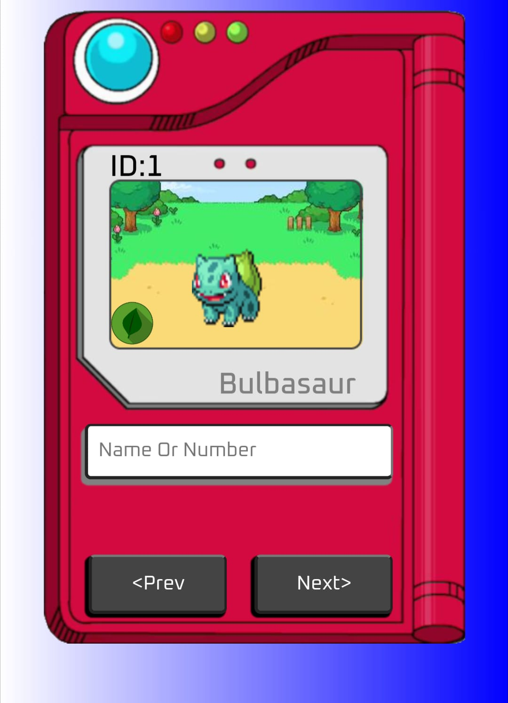

# Projeto: Pokedex_JS

        

 
 

            Olá, pessoal!!! tudo bem?
            Hoje trago para vocês uma pokedex feita utilizando JS,HTML,CSS e a API "PokeAPI"

<h2>Para quem se interessar pela API...</h2>
        

            
        

<h3>Sobre os ícones de tipo...</h3>

  não posso deixar de dar créditos ao autor dos ícones:
  <a href="https://pixabay.com/pt/users/dcemr_e-8920463/">
      Joshua Eckstein
  </a>

